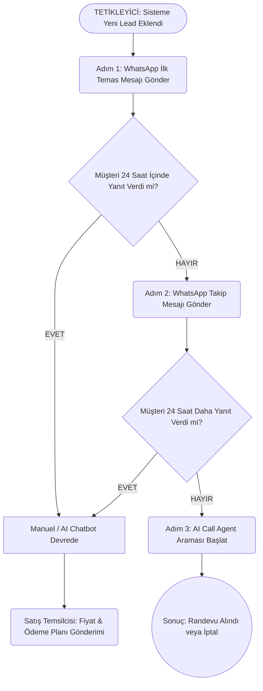

# NovoCRM Outreach Modülü: Eğitim ve Akış Dokümanı

Bu doküman, satış ve pazarlama senaryolarını yazan ekip arkadaşlarına **NovoCRM Outreach (Otomasyon) Modülünün** teknik olarak nasıl çalıştığını ve hazırlanan scriptlerin sisteme nasıl entegre edildiğini basit bir akış örneğiyle anlatmak için hazırlanmıştır.

---

## 1. Outreach (Damlama Kampanyası) Mantığı Nedir?

NovoCRM'de outreach modülü, satış personelinin müşterileri tek tek takip etmesi yerine; belirlediğimiz **"tetikleyiciler (triggers)"**, **"zamanlayıcılar (delays)"** ve **"koşullar (conditions)"** ile süreci tamamen otomatik hale getiren bir motordur.

Siz bir senaryo (script) yazdığınızda, yazılım bu senaryoyu *"Müşteri ne yaparsa / hangi aşamadaysa"* mantığına oturtarak doğru zamanda doğru metni gönderir. 

---

## 2. Hazırlanan Scriptler İle Örnek Bir Akış Kurgusu

Sizin hazırladığınız WhatsApp ve Yapay Zeka Arama scriptlerini kullanarak tipik bir "Novo Park Vista - Kocaeli" projesi kampanya akışının nasıl çalıştığını aşağıda görebilirsiniz:

### Akış Diyagramı

### Akışın Adım Adım Çalışma Prensibi

**Tetikleyici (0. Dakika):** 
Müşteri Facebook/Google formunu doldurur ve NovoCRM'e yeni bir kayıt olarak düşer. Sistem bunu algılar ve hemen otomasyonu başlatır.

**Adım 1: İlk Temas (Hemen)**
Sistem, hazırladığınız 1. Scripti ilgili müşterinin adını (`{{isim}}`) otomatik doldurarak Meta WhatsApp API üzerinden yollar.
> *Sistem Çıktısı:* "Merhaba **Ahmet Bey**, Size Novo İnşaat’tan ulaşıyorum. Kocaeli MİA bölgesindeki yeni yatırım projemiz NOVO Park VISTA için..."

**Adım 2: Bekleme ve Kontrol (24. Saat)**
Sistem 24 saat boyunca bekler ve müşterinin yanıt verip vermediğini kontrol eder.
*   **Müşteri Yanıt Verirse:** Otomasyon durur. Artık CRM'deki AI Chatbot veya Canlı Satış Temsilcisi görüşmeyi devralır. Hazırladığınız *3. Yüksek Gelir Premium* veya *5. Fiyat Gönderim Scripti* bu aşamada manuel ya da chatbot aracılığıyla kullanılır.
*   **Müşteri Yanıt Vermezse:** Sistem otomatik olarak Adım 3'e geçer.

**Adım 3: Takip (24. Saatin Sonu)**
Müşteri ilk mesaja dönmediği için hazırladığınız 2. Script devreye girer.
> *Sistem Çıktısı:* "Merhaba **Ahmet Bey**, Geçen gün bilgi aldığınız NOVO Park VISTA projesiyle ilgili tekrar ulaşmak istedim..."

**Adım 4: Yapay Zeka ile Sesli Arama (48. Saat)**
Eğer müşteri 2. WhatsApp mesajına da yanıt vermezse, sistem bu kez Vapi.ai (Sesli AI Asistan) modülünü tetikler. 
Müşterinin telefonu çalar ve hazırladığınız *6. Arama Scripti* ile asistan konuşmaya başlar.
> *Asistan (Sesli):* "Merhaba Ahmet Bey, Novo İnşaat’tan arıyorum. NOVO Park VISTA projemiz için bilgi talebiniz olmuştu, uygun musunuz?"

---

## 3. Script Yazanlar İçin Teknik İpuçları

Metinlerinizi hazırlarken CRM'in altyapısını göz önünde bulundurarak aşağıdaki kurallara dikkat etmeniz süreci kusursuzlaştıracaktır:

1.  **Dinamik Değişkenler (Parametreler):** 
    CRM her müşteriye özel mesaj atar. Bu nedenle metinlerinizde değişken olan yerleri köşeli parantez veya süslü parantez ile belirtin. Örnek: `{{isim}}`, `{{proje_adi}}`, `{{temsilci_adi}}`. Biz bunları yazılımda gerçek verilerle dolduruyoruz.
2.  **Meta (WhatsApp) 24 Saat Kuralı:** 
    Eğer müşteri size mesaj atmazsa, ilk gönderilen veya takip için gönderilen tüm mesajlar Meta tarafından onaylanmış **Şablon (Template)** olmak zorundadır. Bu yüzden Adım 1 ve Adım 3 gibi otomasyon mesajlarınız ne kadar net, harekete geçirici (CTA) ve kısa olursa Meta'nın onayından o kadar kolay geçer.
3.  **Sesli Asistanın (AI Agent) Doğası:**
    AI telefon araması scriptleri (Adım 4) WhatsApp mesajı gibi okunmamalıdır. Asistan nefes alır, duraklar, karşı tarafı dinler. Bu yüzden diyalog senaryolarınızı yazarken *"(Cevap bekle)"*, *"(İtiraz gelirse şunu söyle)"* şeklinde yönlendirmeler yazmanız, asistanın promptunu (beynini) programlamamız açısından hayati önem taşır.
