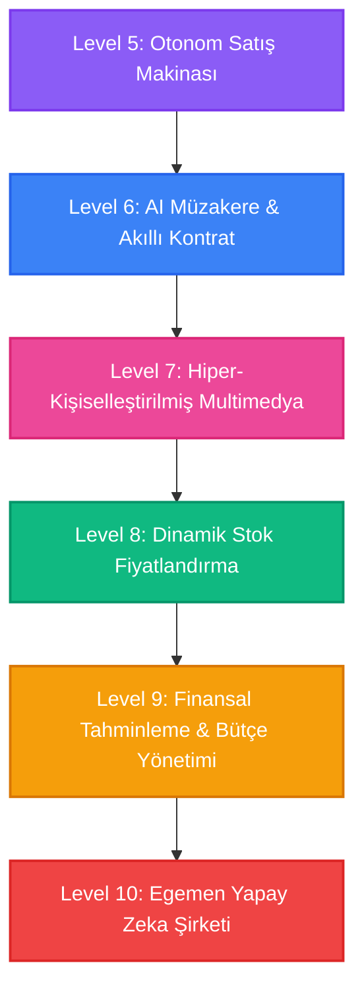

# NovoCRM AI Olgunluk Yol Haritası: Level 5'ten Level 10'a Gidiş 🚀

Bu doküman, gayrimenkul ve inşaat sektöründe otonom yapay zekanın (Autonomous AI) gelebileceği en üst sınırları, vizyoner bir yol haritası olarak sunar.

---

## 🗺️ Yapay Zeka Satış & Operasyon Seviyeleri

---

## 🧠 Seviyelerin Detayları ve Mimari Gereksinimleri

### 🚀 Level 5: Otonom Satış Makinası (Mevcut Durum)
*AI kampanyaları kendi yönetir, kanalları seçer ve başarısından öğrenir.*
* **Yetenekler:** AI 0-100 Lead Skorlama, A/B Script Testi, Çok Kanallı (Call/WA/SMS) Akıllı Seçim, Ciro Katkı Analizi (Attribution), Otomatik Segment Önerileri, Self-Learning Script.
* **Gereksinim:** CRM Etkileşim Verisi & Meta/Vapi Entegrasyonu.

---

### 🤝 Level 6: AI Müzakere & Akıllı Kontrat (Negotiation Agent)
*Müşteri ile fiyat pazarlığını ve ödeme planı esnetmesini otonom olarak yapan AI.*
* **Yetenekler:**
  * **AI-to-AI / AI-to-Human Pazarlık:** Müşterinin bütçesine göre projenin kar marjı sınırları dahilinde alternatif ödeme planları (peşinat/taksit oranları) üretme ve müzakere etme.
  * **Otonom Sözleşme Taslağı:** Anlaşılan şartları (teslim tarihi, ödeme planı, cezai şartlar) hukuki şablonlara döküp taraflara e-imza (DocuSign/e-Tuğra) linki olarak iletme.
* **İş Değeri:** Satış döngüsünü saatlere indirir, temsilcilerin onay mekanizmalarındaki bürokrasiyi sıfırlar.

---

### 📹 Level 7: Hiper-Kişiselleştirilmiş Multimedya (Visual & Voice Immersion)
*Müşteriye özel video, ses ve 3D dünya üreten görsel zeka.*
* **Yetenekler:**
  * **Kişiye Özel 3D Video Turu:** Müşterinin adıyla hitap eden ve onun en çok ilgilendiği özellikleri (örneğin "Fatih Bey, çocuk odası ve güney cephe detayları") öne çıkaran yapay zeka tarafından render edilmiş kişiselleştirilmiş proje tanıtım videoları.
  * **Karakter & Ton Aynalama (DISC):** Maya'nın ses tonunu ve konuşma hızını, müşterinin karakter analizine (hızlı/detaycı/duygusal) göre anlık olarak optimize etmesi.
* **İş Değeri:** Klasik broşürlerin yerini alan, müşteride benzersiz bir "bana özel" hissi yaratan görsel pazarlama.

---

### 📈 Level 8: Dinamik Stok Fiyatlandırma (Dynamic Inventory Pricing)
*Konut fiyatlarının borsadaki gibi arz-talep-kampanya verisine göre anlık değişmesi.*
* **Yetenekler:**
  * **Algoritmik Birim Fiyatlandırma:** Projedeki ünitelerin fiyatlarını; o cepheye gelen web trafiği, AI Lead skorlarının yoğunluğu, TCMB konut endeksi, enflasyon ve rakip projelerin fiyatlarına göre dinamik olarak yukarı/aşağı güncelleme.
  * **Akıllı Stok Kilitleme (Scarcity Engine):** Talep patlaması yaşayan üniteleri satıştan geçici çekip, daha az talep görenleri öne çıkararak proje karlılığını maksimize etme.
* **İş Değeri:** Proje ciro kapasitesini (GDV) %12 ila %18 oranında doğrudan artırma.

---

### 📊 Level 9: Finansal Tahminleme & Bütçe Yönetimi (Autonomous CFO)
*Şirketin gelecekteki nakit akışını ve reklam bütçesini yöneten finansal yapay zeka.*
* **Yetenekler:**
  * **Nakit Akışı Tahminleme:** Müşterilerin geçmiş ödeme davranışlarını ve AI skorlarını analiz ederek, önümüzdeki 6 ay içinde hangi taksitlerin gecikeceğini, kasaya ne kadar nakit gireceğini tahmin etme.
  * **Otonom Reklam Bütçesi Dağıtımı:** Elde edilen ciro attribution (gelir katkısı) verilerine göre; bütçeyi Meta Ads, Google Ads ve Outreach kanalları arasında en düşük Müşteri Edinme Maliyeti (CAC) sağlayan mecraya otonom olarak kaydırma.
* **İş Değeri:** Şirketin likidite krizlerini önceden engelleme ve pazarlama ROI'sini maksimize etme.

---

### 👑 Level 10: Egemen Yapay Zeka Şirketi (The Sovereign Enterprise)
*İnsanın sadece onay makamı olduğu, kendi kendini fonlayan ve inşa eden egemen şirket.*
* **Yetenekler:**
  * **Arazi Keşfi & Fizibilite:** E-devlet, imar ve tapu verilerinden kat karşılığı veya satılık en karlı arazileri bulup fizibilite raporu hazırlar.
  * **Proje Geliştirme & Satış:** Mimari tasarım alternatiflerini üretir, hedef kitleyi belirler, reklamları açar, satışları otonom tamamlar, taşeron hak edişlerini blokzincir/akıllı kontratlarla otonom öder.
  * **İnsan Rolü:** Yönetim Kurulu seviyesinde sadece stratejik hedefleri onaylamak ve kritik imza yetkilerini kullanmak.
* **İş Değeri:** İnsan hatasından arındırılmış, 7/24 büyüyen küresel bir gayrimenkul geliştirme devine dönüşüm.

---

## 🎯 Bir Sonraki Adım: NovoCRM'i Nereye Taşıyalım?

Şu an elimizdeki güçlü altyapı ile **Level 6 (AI Müzakere & Dinamik Ödeme Planı Teklifleri)** fazı için en uygun aşamadayız. 

### Öneri Geliştirme Modülü (Level 6 Başlangıcı):
1. **Dinamik Teklif Sihirbazı:** CRM üzerinde müşterinin bütçesini girdiğinizde, projenin minimum karlılık sınırlarını aşmadan taksit, vade ve peşinat oranlarını optimize edip müşteriye anında WhatsApp üzerinden etkileşimli teklif (proposal) linki gönderen sistem.
2. **AI Müzakereci (Negotiator):** Müşteri teklif linkinde "Peşinatı düşürürsem taksit ne olur?" diye sorduğunda, arka planda AI'ın parametreler dahilinde yeni ödeme planı teklifleri sunması.
